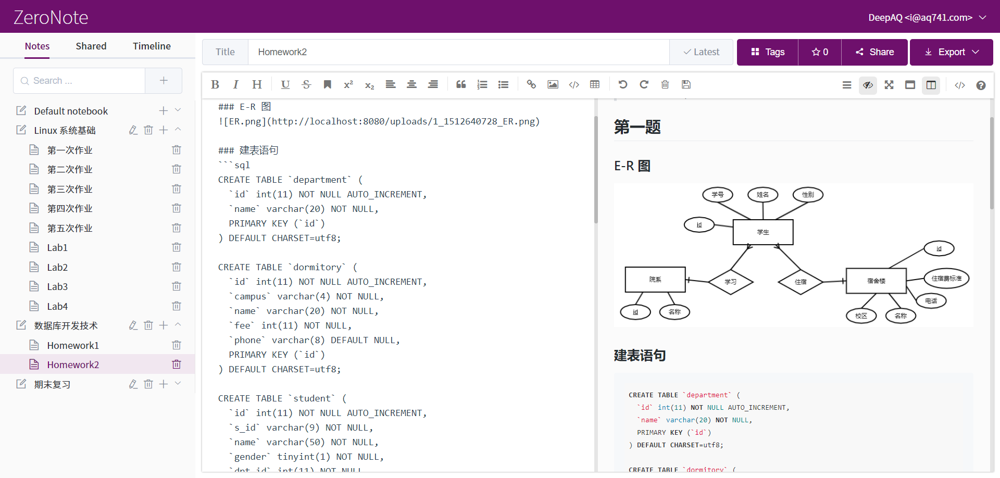

# ZeroNote

## 项目简介
ZeroNote 是一个在线笔记平台，基于开发者社区流行的 Markdown 格式。平台提供笔记管理、分享、协作等功能。

## 功能
- 用户注册、登录、信息更改
- 管理员浏览用户列表、禁用/启用用户
- 笔记本、笔记的增删改查
- 笔记本、笔记名称模糊搜索，笔记全文检索
- 笔记可添加标签、按标签搜索
- 笔记内支持多种文本格式，支持图片上传
- 笔记可导出为 Markdown / PDF 格式
- 笔记可分享至其他用户（读/写权限），可浏览/编辑被分享的笔记
- 支持多人协同写作，同时编辑同一个笔记不产生冲突
- 用户可相互关注，笔记公开分享，点赞排名
- Chrome 插件实现网页文字内容截取保存

## License
AGPLv3 License
